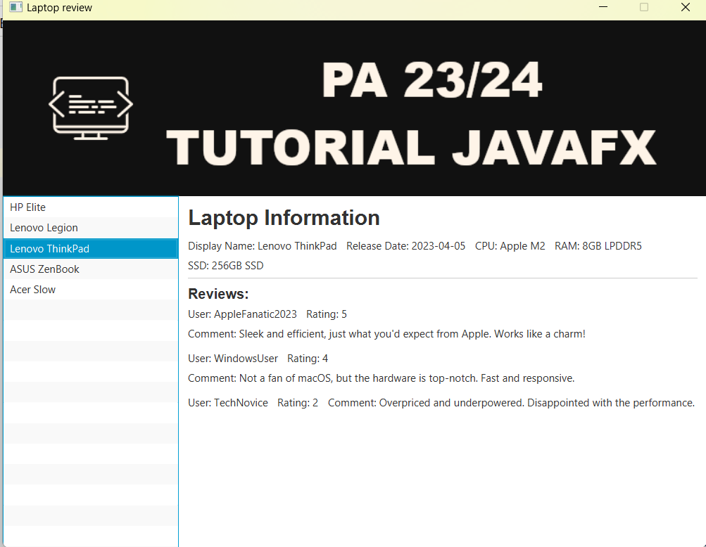
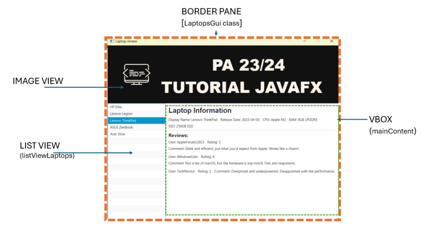

# Lab1

## Objectives

- Preparation and adaptation to the development environment
- Review of JavaFX for GUI creation

## 1 - Introduction

### JavaFX

JavaFX is a software platform developed by Oracle to create applications that run in a desktop environment and graphical user interfaces (GUIs) in Java. It provides a set of libraries and tools for creating interactive graphical applications that can run on various platforms, including Windows, macOS, and Linux. JavaFX is an alternative to the Swing technology, which was previously used to create GUIs in Java.

### Maven

Maven is a tool that helps developers manage software development projects, whose strengths include:

- **Dependency Management**: Maven helps control the libraries (or dependencies) your project needs to function. Instead of manually downloading these libraries, Maven does this automatically, saving time and avoiding errors.

- **Standard Directory Structure**: Maven defines a standard structure for organizing your project. This facilitates collaboration with other developers, as everyone follows the same conventions.

- **Compilation and Build**: Maven simplifies the compilation of the source code to generate an executable program. Additionally, it can create packages (such as JAR files) ready to be distributed.

- **Project Lifecycle**: Maven follows a defined lifecycle with steps such as compilation, testing, packaging, and deployment. This helps ensure that the project runs as expected.

- **Plugins**: Maven is highly extensible through the use of plugins. This means that you can add extra functionalities to Maven, customizing it to meet the specific needs of your project.

- **Version Management**: Maven helps control the versions of a given project. This is important when updates or bug fixes are needed in different parts of the source code.

In summary, Maven is a tool that facilitates software development, automating common tasks like dependency management and compilation, while promoting a standardized organization of projects. It is widely used in the Java software development community and is a valuable tool to simplify the process of building applications based on this programming language.

## 2 - Setting up the Development Environment

### Java Development Kit (JDK)

You should use a version of the Java Development Kit (JDK) that supports JavaFX. The recommended version for this course is BellSoft Liberica JDK, version 17 LTS. Download available at [BellSoft JDK Downloads](https://bell-sw.com/pages/downloads/#/java-17-lts)

- **Note**: You should always choose a Full JDK package.

### Integrated Development Environment (IDE)

- Download IntelliJ IDEA Community: [IntelliJ IDEA](https://www.jetbrains.com/idea/download/)

- Optional: Obtain an Educational License for the full suite of JetBrains products, including IntelliJ IDEA Ultimate: [JetBrains Education](https://www.jetbrains.com/community/education/)

### Version Control System (VCS)

- Register an account on GitHub using your institutional email: [GitHub](https://github.com/). If you have already completed this step in previous courses, ensure you have the necessary credentials.

- Optional: Install GitHub Desktop if you want to manage repositories outside the IDE: [GitHub Desktop](https://desktop.github.com)

## 3 - JAVA Development Exercise

- The goal is to complete the application provided in the repository to obtain an application with the layout shown in Figure 1.
- The application should allow viewing information about laptop characteristics and their reviews.
- The application reads the data to be displayed from the file `laptop_reviews.json`.


1) Clone the repository.
2) Compile and run the presented code. (Note: Ensure you are using the recommended JDK by accessing the "Menu -> File -> Project Structure" option in the IDE.)
3) Carefully examine the following classes:
   - `Laptop` - contains information about a laptop.
   - `Review` - contains information about a laptop review.
   - `LapTopsGui`
     - It is responsible for creating the graphical interface components shown in Figure 2 and implementing user interaction.
     - The method `List<Laptop> loadData() throws FileNotFoundException` loads information about the laptops.
     - The method `ImageView loadThumbnailImage() throws FileNotFoundException` loads the image for the banner.
  
4) Based on Figure 2, which identifies the main types of *containers* used to build the interface, complete the `initComponents()` method to achieve the presented layout.
   
5) Implement the interaction for selecting an item in the ListView (`listViewLaptops`) so that each time a laptop is selected in the ListView, its information is updated in the `mainContent` panel.

## Supplementary Exercises

1) Add a form to allow new "reviews" to be added to a laptop. This form should allow the input of information for a new `Review`:
   - Username
   - Rating
   - Comments
  
   It is suggested that this information be entered using `TextField` components. Additionally, there should be a button that, when pressed, reads the information from the `TextFields`, creates a new instance of `Review`, and adds it to the selected Laptop object.

2) When closing the program, the updated information (with the new reviews added) should be saved to the JSON file. (See: [Gson tutorial](https://howtodoinjava.com/gson/gson/)).

   - Implement a method called `saveData()` to update the data file.
   - Associate the execution of this method with the application’s close event.
   
   ```java
   primaryStage.setOnCloseRequest(new EventHandler<WindowEvent>() {
       @Override
       public void handle(WindowEvent event) {
           //call saveData() method
           System.out.println("Closing...");
       }
   });
   ```

